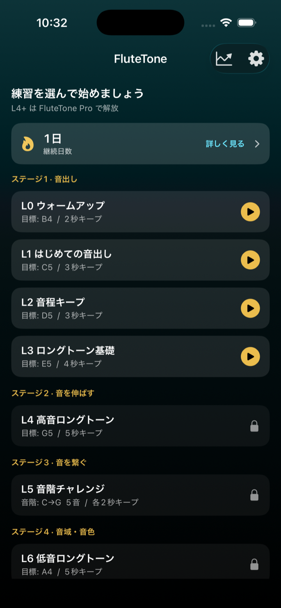

# FluteTone — Flute tone & long-tone practice (User Guide)

**Version:** 1.1.0  
**Last updated:** 2026-08-06

<a href="guide">日本語</a> · <strong>English</strong>

**FluteTone** helps beginner flutists with **first tone and long tones** by showing **pitch and keep time** from the microphone on iPhone / iPad. Use it when sound production or intonation feels unstable. Levels **L0–L3 are free**.

| Where | Name |
|------|------|
| App Store | **FluteTone** |
| Home screen | **FluteTone** |
| In-app | **FluteTone** / **FluteTone Pro** |

**Install:** [Open FluteTone on the App Store](https://apps.apple.com/app/id6795169747)  
(See also [Get the app](#get-the-app) for a QR code.)

This page is a screen-by-screen walkthrough after the short in-app tutorial (**Settings → Getting started**).

  

- [Support](support-en)
- [Privacy Policy](privacy-policy-en)
- [Terms of Use](terms-of-use-en)

---

## 1. Choose a practice on Home

Home lists practice levels. **L0–L3 are free**; **L4 and later require FluteTone Pro** (some levels show as Coming soon). Tapping a locked row opens the Pro upgrade sheet.

You can also check your streak and open the progress hub from the chart icon in the top right.

---

## 2. During practice

Confirm the target tone in preview, then Listen → countdown starts the session. The **REC** indicator means the practice session is being recorded.

See [§4 Panel reference](#4-panel-reference) for what each panel means, and [§3 Changing panel layout](#3-changing-panel-layout) to show, hide, resize, or reorder panels.

In Settings you can also adjust the reference pitch (A = 438–445 Hz) and tone-break detection.

---

## 3. Changing panel layout

Customize practice and review panels in **Settings → Panel layout**:

1. **Practice panels** — layout during a session  
2. **Review panels** — layout on the review screen  

On each screen you can:

- **Show / hide** panels (at least one main panel stays visible)
- **Size** — Small / Medium / Large
- **Reorder** — drag the control on the right
- **Preview layout** — full-screen check (rotate the device for landscape)
- **Restore default layout** — reset to the initial arrangement

Placement adapts automatically to the screen size. Tap **ⓘ** next to a panel name for a short in-app description.

Turning on a Pro-only panel (such as mouth camera) on the free plan opens the upgrade prompt.

---

## 4. Panel reference

### Practice

| Panel | What it shows |
|--------|----------------|
| Pitch guide | Target pitch band scrolls left, with your played pitch as a trail. Center line is “now”; gold marks the target |
| Goal progress | Long tone: keep time vs goal. Scale: notes cleared vs total |
| Clarity | How clean the tone sounds right now (live) |
| Stability | How steady the pitch is right now (live) |
| Hold | Seconds held inside the target zone |
| Mic input | Input level—if low, move closer or blow more steadily |
| Coach | Short tips (too high/low, near tune, need more sound) |
| Input waveform | Attack and continuity of your sound |
| Harmonic balance | Fundamental and overtones—a strong fundamental with gradual overtones usually means a clearer tone |
| Scale progress | (Scale levels) How many scale notes you cleared |
| Mouth camera (Pro) | Front-camera embouchure view; frame with zoom/pan before practice |

### Review

| Panel | What it shows |
|--------|----------------|
| Playback | This practice, favorite/reference, or both; mix with the slider in Together mode |
| Pitch trend | Vertical = pitch, horizontal = time; shaded band is the target; blue = this practice, gold = reference when shown |
| Volume | Relative loudness over time (not pitch) |
| Hold | Longest in-tune keep time in the session |
| Clarity / Stability | Peak values for the session |
| Pitch accuracy | How close average pitch was to the target (higher is better) |
| Harmonic balance | Clarity / resonance guide |
| This practice (mouth, Pro) | Mouth video from the session, synced to audio |
| Favorite (mouth, Pro) | Comparison clip; sample framing guide if none is saved |

---

## 5. Practice review

After a session, Review shows Cleared / Not cleared, pitch trend, playback, volume, and scores.

Use **Save target** to keep a favorite tone (manage later in **Settings → Practice targets**).

Audio review is available on the free plan. Mouth-camera video panels are Pro.

---

## 6. FluteTone Pro

Pro unlocks:

- L4+ practice (high notes, chromatics, endurance, scales; some levels coming soon)
- Mouth-camera and review video panels
- Unlimited history
- Per-level growth charts

Purchase or restore from **Settings → Subscription**. Cancel in iOS Settings → Apple ID → Subscriptions.

---

## 7. Free vs Pro

| Feature | Free | Pro |
|------|------|------|
| Levels | L0–L3 | L4+ (except Coming soon) |
| Audio review | Yes | Yes |
| Mouth-camera panels | — | Yes |
| History | Last 5 | Unlimited |
| Growth charts | — | Yes |

---

## 8. Mouth camera (Pro)

- Turn on mouth-camera panels from **Settings → Panel layout** (practice / review).
- Free users who enable a Pro panel see the upgrade prompt.
- Video stays on device; it is not sent to developer servers.
- Camera permission is requested only when using mouth panels. Audio-only practice needs the microphone only.

---

## 9. Progress and history

- Open the progress hub from the chart icon on Home.
- Streak is free; growth charts are Pro.
- Delete individual or all records in **Settings → Practice data**.

---

## Get the app

Start free (L4+ and mouth camera require FluteTone Pro).

**Open on the App Store:** [FluteTone](https://apps.apple.com/app/id6795169747)

  

1. Scan the QR with your iPhone / iPad camera, then tap the link  
2. Tap **Get** (or **Redownload**) on the App Store

You can also search the App Store for **“FluteTone”** or **“flute tone”**.

---

## Related

- **[Get it on the App Store](https://apps.apple.com/app/id6795169747)**
- [Support](support-en)
- [Terms of Use](terms-of-use-en)
- [Commercial Transactions Act disclosure (Japanese)](tokushoho)
- [日本語の使い方ガイド](guide)
