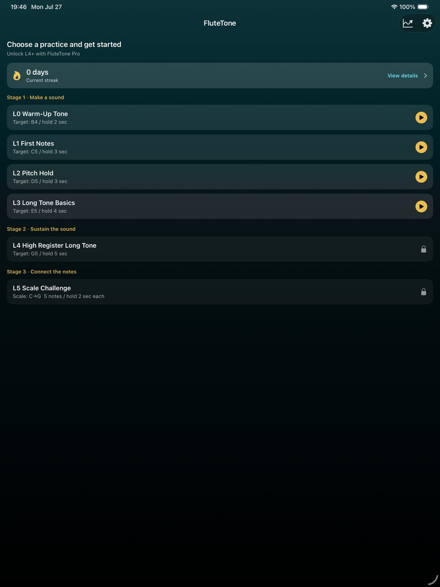
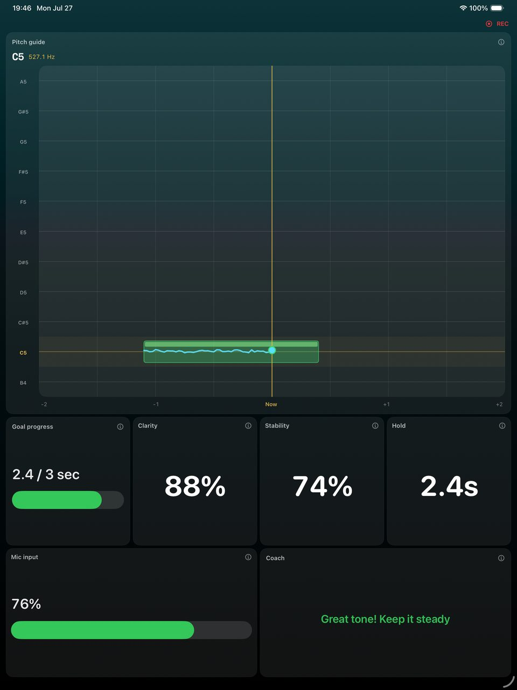
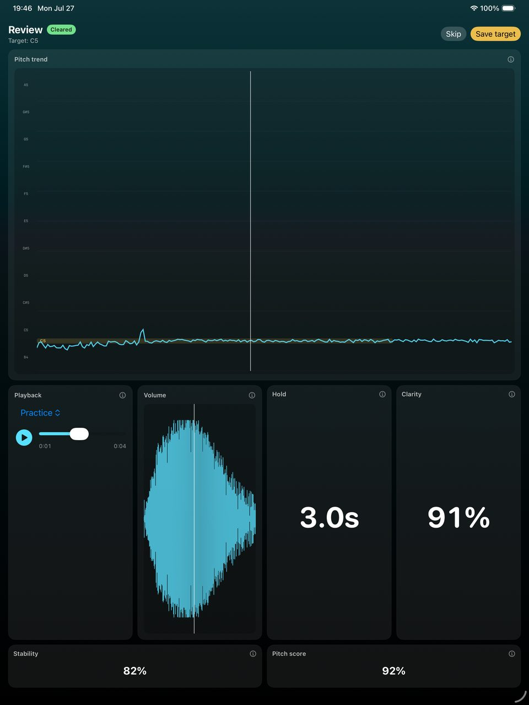
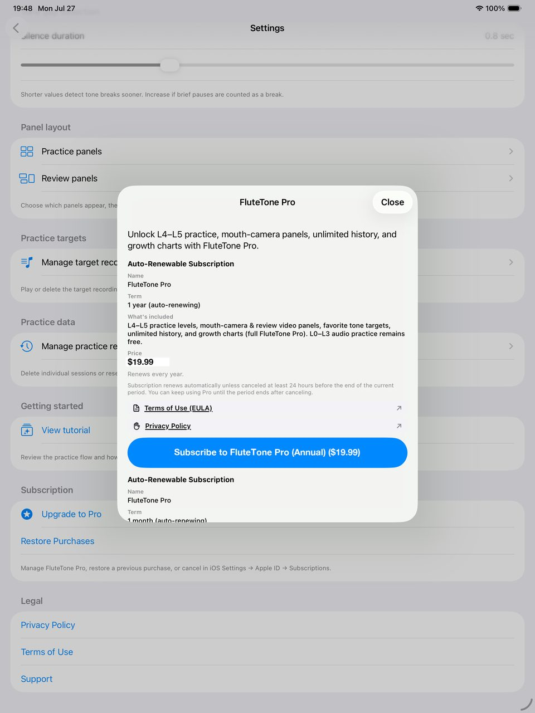

# FluteTone — User Guide

**Version:** 1.0.0  
**Last updated:** 2026-07-27

<a href="guide">日本語</a> · <strong>English</strong>

This page is the user guide for **FluteTone**, a flute tone practice app. Use it when you want a screen-by-screen walkthrough after the short in-app tutorial (**Settings → Getting started**).

- [Support](support)
- [Privacy Policy](privacy-policy)
- [Terms of Use](terms-of-use)

---

## 1. Choose a practice on Home

Home lists levels **L0–L5**. **L0–L3 are free**; **L4–L5 require FluteTone Pro**. Tapping a locked row opens the Pro upgrade sheet.

You can also check your streak and open the progress hub from the chart icon in the top right.

---

## 2. During practice

Confirm the target tone in preview, then Listen → countdown starts the session.

| Panel | What it shows |
|--------|----------------|
| Pitch guide | Current note, Hz, and pitch trail near the target |
| Goal progress | Progress toward the hold-time goal |
| Clarity / Stability | How clear and steady the tone is |
| Hold | Seconds held inside the target zone |
| Mic input | Input level |
| Coach | Short coaching tips |

The **REC** indicator means the practice session is being recorded.

In Settings you can also adjust the reference pitch (A = 438–445 Hz) and tone-break detection.

---

## 3. Practice review

After a session, Review shows Cleared / Not cleared, pitch trend, playback, volume, and scores.

Use **Save target** to keep a favorite tone (manage later in **Settings → Practice targets**).

Audio review is available on the free plan. Mouth-camera video panels are Pro.

---

## 4. FluteTone Pro

Pro unlocks:

- L4 high-register long tone / L5 scale challenge
- Mouth-camera and review video panels
- Unlimited history
- Per-level growth charts

Purchase or restore from **Settings → Subscription**. Cancel in iOS Settings → Apple ID → Subscriptions.

---

## 5. Free vs Pro

| Feature | Free | Pro |
|------|------|------|
| Levels | L0–L3 | L0–L5 |
| Audio review | Yes | Yes |
| Mouth-camera panels | — | Yes |
| History | Last 5 | Unlimited |
| Growth charts | — | Yes |

---

## 6. Mouth camera (Pro)

- Turn on mouth-camera panels from **panel layout** for practice and review.
- Free users who enable a Pro panel see the upgrade prompt.
- Video stays on device; it is not sent to developer servers.
- Camera permission is requested only when using mouth panels. Audio-only practice needs the microphone only.

---

## 7. Progress and history

- Open the progress hub from the chart icon on Home.
- Streak is free; growth charts are Pro.
- Delete individual or all records in **Settings → Practice data**.

---

## Related

- [Support](support)
- [Terms of Use](terms-of-use)
- [Commercial Transactions Act disclosure (Japanese)](tokushoho)
- [日本語の使い方ガイド](guide)
