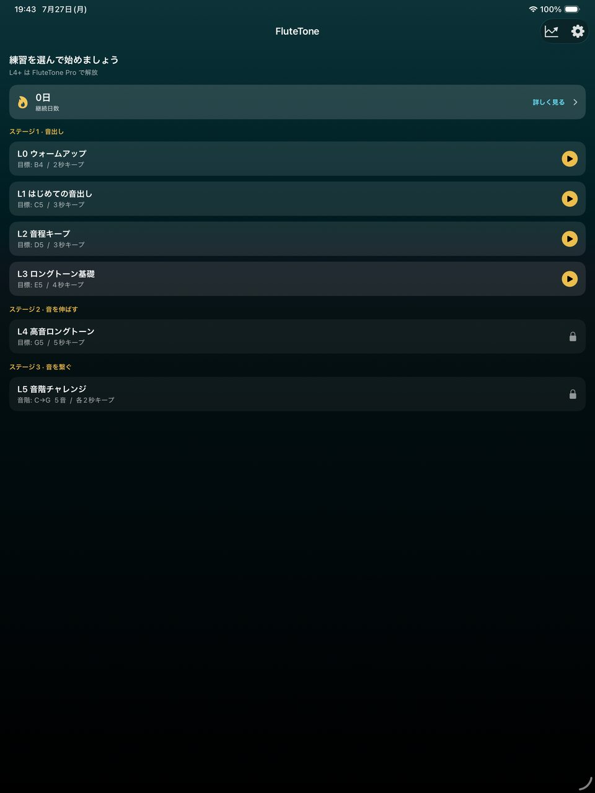
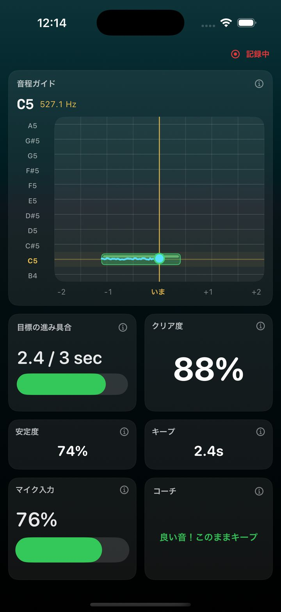
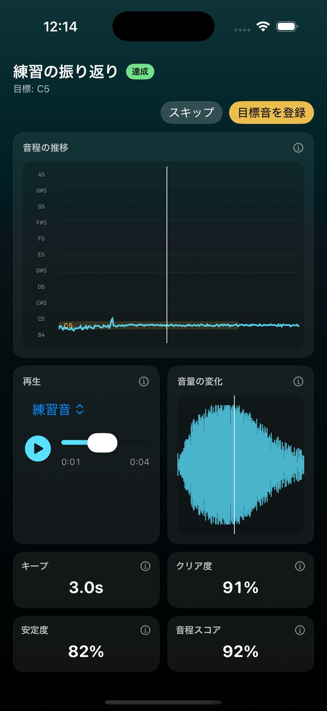
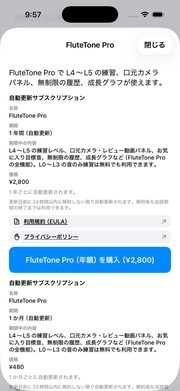

# FluteTone — 使い方ガイド

**対象バージョン:** 1.1.0  
**最終更新日:** 2026-08-05

<strong>日本語</strong> · <a href="guide-en">English</a>

**FluteTone** は、フルート初心者の音出し・ロングトーンを、音程とキープ秒数で見える化する練習アプリです。部活やレッスンで「音が出ない」「音程が安定しない」ときの補助に使えます。L0〜L3 は無料です。

**[App Store で入手する](https://apps.apple.com/app/id6795169747)**

本ページは画面つきの操作ガイドです。アプリ内の短いチュートリアル（設定 → 使い方）のあとに、詳しく確認したいときにもご覧ください。

- [サポート（お問い合わせ）](support)
- [プライバシーポリシー](privacy-policy)
- [利用規約](terms-of-use)

---

## 1. ホームで練習を選ぶ

ホームではレベル（L0〜）が一覧表示されます。**L0〜L3 は無料**、**L4 以降は FluteTone Pro** です（一部レベルは「開発中」表示）。ロック付きの行をタップすると Pro の案内が開きます。

継続日数（ストリーク）や、右上のグラフアイコンから進捗ハブも開けます。

---

## 2. 練習中の見かた

プレビューで目標音を確認し、Listen → カウントダウンのあと練習が始まります。画面上部の **記録中** は、練習セッションの記録中であることを示します。

主なパネルの意味は [§4 パネルの説明](#4-パネルの説明) を参照してください。表示のオン／オフや並びは [§3 パネルレイアウトの変更](#3-パネルレイアウトの変更) で変えられます。

設定では基準ピッチ（A=438〜445Hz）や音の途切れ判定も調整できます。

---

## 3. パネルレイアウトの変更

練習中・振り返りで使うパネルは、**設定 → パネルレイアウト** から変更できます。

1. **練習中のパネル** … 練習画面の構成  
2. **レビューのパネル** … 振り返り画面の構成  

各画面では次ができます。

- **表示のオン／オフ** … 使わないパネルをオフにできます（主要パネルは最低1つ残ります）
- **大きさ** … 小／中／大
- **並べ替え** … 右側のコントロールをドラッグして順番を変更
- **レイアウトをプレビュー** … いまの配置を全画面で確認（端末を回転すると横向きも確認できます）
- **標準レイアウトに戻す** … 初期配置にリセット

配置は画面サイズに合わせて自動調整されます。パネル名の横の **ⓘ** をタップすると、そのパネルの短い説明もアプリ内で読めます。

口元カメラなど Pro 専用パネルを無料プランでオンにすると、アップグレード案内が表示されます。

---

## 4. パネルの説明

### 練習中

| パネル | 内容 |
|--------|------|
| 音程ガイド | 目標音の帯が左へ流れ、吹いた音の軌跡が重なります。中央の線が「いま」、金色が目標音です |
| 目標の進み具合 | ロングトーンはキープ時間、音階はクリアした音数への進み |
| クリア度 | いまの音のきれいさ（ライブ） |
| 安定度 | いまの音程の安定度（ライブ） |
| キープ | 目標音に乗せている秒数 |
| マイク入力 | 入力の大きさ。低いときは近づくか息を安定させてください |
| コーチ | 高い／低い／近い／音が小さいなどの短い助言 |
| 入力波形 | 立ち上がりや途切れの確認用 |
| 倍音バランス | 基音と倍音の強さ。基音がしっかりし倍音がゆるやかだとクリアな音色になりやすいです |
| 音階の進み具合 | （音階レベル）クリアした音階の音数 |
| 口元カメラ（Pro） | 前面カメラの口元映像。練習前にズームと位置を合わせます |

### 振り返り（レビュー）

| パネル | 内容 |
|--------|------|
| 再生 | 今回の練習音・お気に入り（または基準音）・同時再生。同時のときはスライダーで混ぜ具合を調整 |
| 音程の推移 | 縦＝音程、横＝時間。薄い帯が目標。青が今回、金色がお手本（表示時） |
| 音量の変化 | 時間に沿った相対的な音量（音程ではありません） |
| キープ | この練習でキープできた最長時間 |
| クリア度 / 安定度 | この練習でのピーク値 |
| 音程の正確さ | 目標に対する平均的な近さ（高いほど正確） |
| 倍音バランス | 音の澄み・響きの目安 |
| 今回の口元（Pro） | この練習の口元動画（音声と同期） |
| お気に入りの口元（Pro） | 比較用。未登録時は撮影ポジションのサンプルを表示 |

---

## 5. 練習の振り返り

練習が終わると振り返り画面が開きます。達成／未達のバッジ、音程の推移、再生、音量の変化、スコアを確認できます。

気に入った吹き方は **目標音を登録** でお気に入りに残せます（あとから設定 → 練習の目標音で管理）。

無料でも音声の振り返りは利用できます。口元カメラの動画パネルは Pro です。

---

## 6. FluteTone Pro

Pro では次が使えます。

- L4 以降の練習（高音・半音・最長キープ・音階など。一部は開発中）
- 口元カメラパネルとレビュー用動画パネル
- 履歴の無制限保存
- レベル別の成長グラフ

購入・復元は **設定 → サブスクリプション** から。解約は iOS の Apple ID → サブスクリプションです。

---

## 7. 無料と Pro のちがい

| 項目 | 無料 | Pro |
|------|------|------|
| レベル | L0〜L3 | L4 以降（開発中を除く） |
| 音声の振り返り | ○ | ○ |
| 口元カメラパネル | - | ○ |
| 履歴 | 直近 5 件 | 無制限 |
| 成長グラフ | - | ○ |

---

## 8. 口元カメラ（Pro）

- **設定 → パネルレイアウト** の練習中／レビューから口元関連パネルをオンにできます。
- 無料ユーザーが Pro パネルをオンにしようとすると、アップグレード案内が表示されます。
- 映像は端末内で扱い、開発者サーバーへ送信しません。
- カメラ権限は口元パネル利用時に求められます。音のみならマイクだけで足ります。

---

## 9. 進捗と履歴

- ホーム右上のグラフアイコンから進捗ハブを開けます。
- ストリークは無料でも確認できます。成長グラフは Pro です。
- 設定 → 練習記録 から、個別削除や全削除ができます。

---

## 関連ページ

- **[App Store で入手する](https://apps.apple.com/app/id6795169747)**
- [サポート](support)
- [利用規約](terms-of-use)
- [特定商取引法に基づく表記](tokushoho)
- [English User Guide](guide-en)
